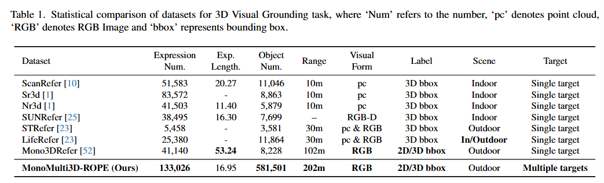
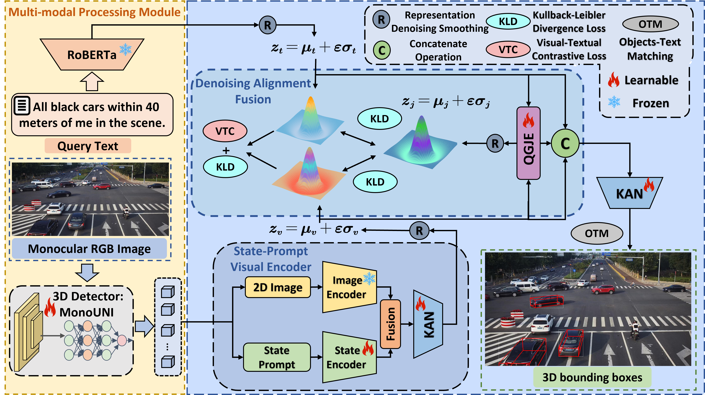
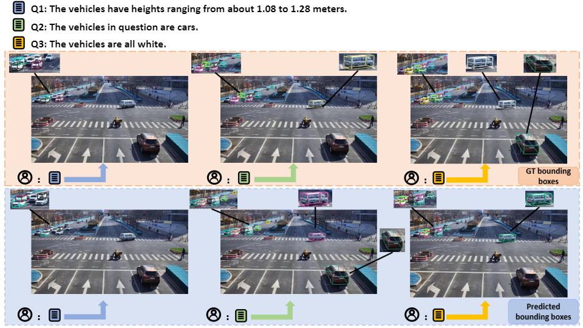
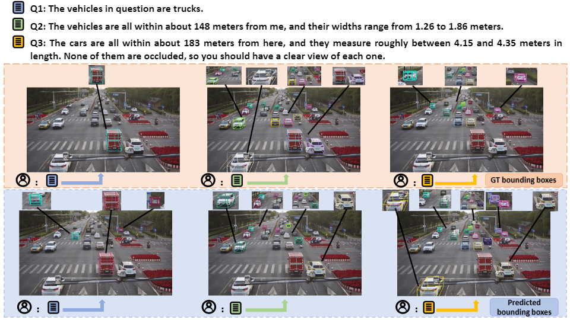

#  Beyond Human Perception: Understanding Multi-Object World from Monocular View
<p align="center">
    
</p>

### This is the official repository for CVPR2025 paper **"Beyond Human Perception: Understanding Multi-Object World from Monocular View"**

<div align="center">
  
  
</div>

##  Dataset
We build the first dataset for MonoMulti-3DVG, termed MonoMulti-ROPE. If you want to obtain our MonoMulti-ROPE dataset, please contact the email below:
```
corcorancarter653@gmail.com
```

<div align="center">
  
</div>

##  CyclopsNet: Architecture

CyclopsNet is the **First RGB-based Multi-object 3D Visual Grounding Network** for monocular view. 
<div align="center">
  
</div>

## 👁️ Visualization

### Visualization analysis from our CyclopsNet.

<div align="center">
  
</div>

<br>

<div align="center">
  
</div>

<br>

<div align="center">
  
</div>

<br>


### A detailed README and checkpoints will be released later.
