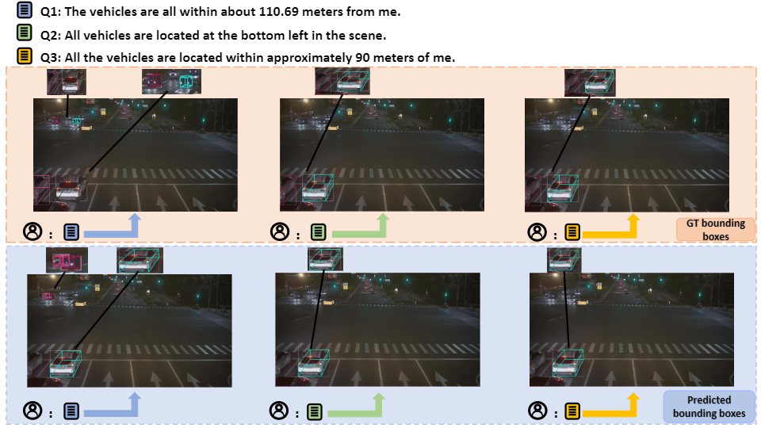
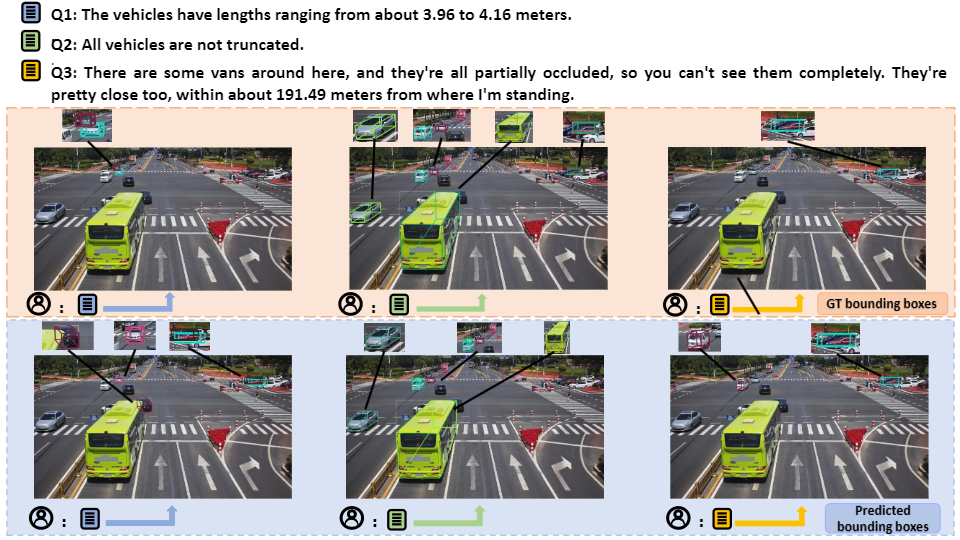
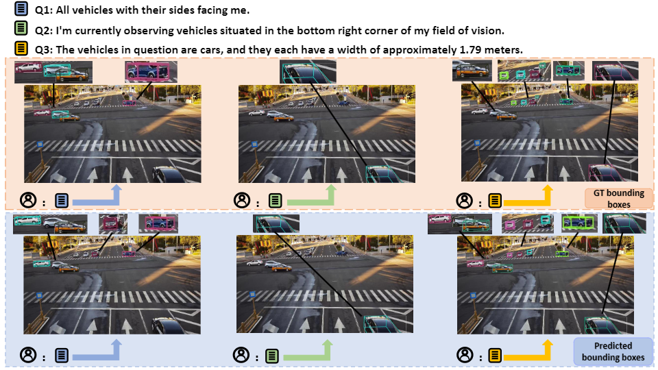
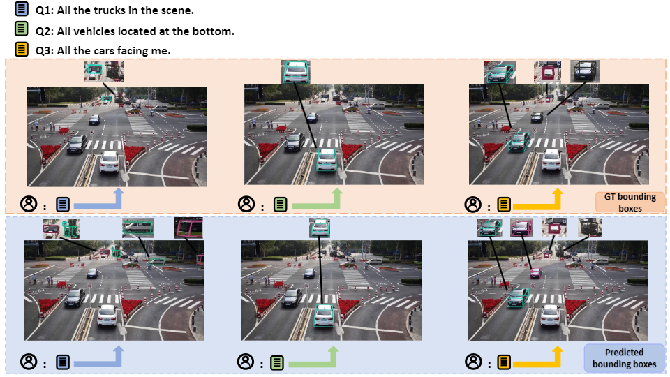
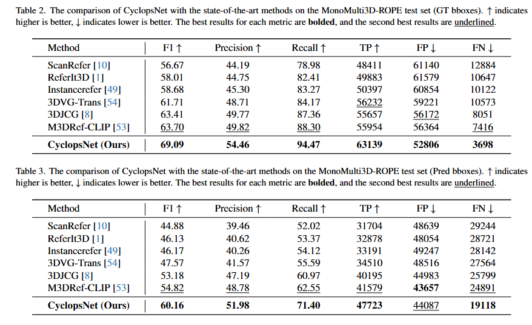

#  Beyond Human Perception: Understanding Multi-Object World from Monocular View
<p align="center">
    
</p>

This is the official repository for paper **"Beyond Human Perception: Understanding Multi-Object World from Monocular View"**


##  Dataset
Download our MonoMulti-ROPE dataset. We build the first dataset for MonoMulti-3DVG, termed MonoMulti-ROPE, which can be downloaded from our [Google Drive](https://drive.google.com/drive/folders/1ICBv0SRbRIUnl_z8DVuH8lz7KQt580EI?usp=drive_link). The download link is available below:
```
https://drive.google.com/drive/folders/1ICBv0SRbRIUnl_z8DVuH8lz7KQt580EI?usp=drive_link
```

<div align="center">
  
</div>

##  CyclopsNet: Architecture

CyclopsNet is the **First RGB-based Multi-object 3D Visual Grounding Network** for monocular view. 
<div align="center">
  
</div>

## 👁️ Visualization

### Visualization analysis from our CyclopsNet.

<div align="center">
  
</div>

<div align="center">
  
</div>

<div align="center">
  
</div>

<div align="center">
  
</div>

<div align="center">
  
</div>

<div align="center">
  
</div>

<div align="center">
  
</div>

<div align="center">
  
</div>

##  Results

<div align="center">
  
</div>


### A detailed README and checkpoints will be released later.
